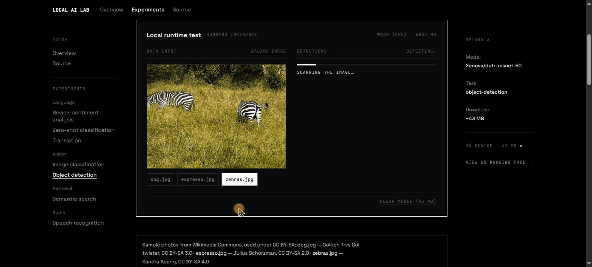

# Local AI Lab

**Run AI models directly in your browser — no server, no API keys, no data leaving your device.**

🔗 **Live demo: [localailab.vercel.app](https://localailab.vercel.app)**

<!-- Replace with a GIF of a demo running (e.g. speech recognition streaming words, or object detection drawing boxes) -->


Local AI Lab is a collection of interactive experiments exploring on-device AI inference with open-source models from Hugging Face. Each experiment pairs a short technical write-up with a working demo: the model's quantized weights are downloaded once, cached in the browser, and run on your own machine using WebGPU, with a WASM fallback for devices that don't support it.

## Experiments

| Experiment | Category | Model | Download |
|---|---|---|---|
| Review sentiment analysis | Language | `distilbert-base-uncased-finetuned-sst-2-english` | ~68 MB |
| Image classification | Vision | `vit-base-patch16-224` | ~88 MB |
| Zero-shot classification | Language | `nli-deberta-v3-xsmall` | ~96 MB |
| Semantic search | Retrieval | `all-MiniLM-L6-v2` | ~24 MB |
| Object detection | Vision | `detr-resnet-50` | ~43 MB |
| Translation (EN → ES) | Language | `opus-mt-en-es` | ~119 MB |
| Speech recognition | Audio | `whisper-base` | ~80 MB |

The download size is shown before any model is fetched, and every demo includes a control to clear the cached model.

## Key technical decisions

- **Inference off the main thread.** Each demo talks to a dedicated Web Worker that owns the Transformers.js pipeline, so the UI stays responsive while models download and run.
- **Models load on demand.** A model is fetched only when you run its demo, not on page load, and download progress is streamed back to the UI.
- **WebGPU first, WASM fallback.** The pipeline prefers the WebGPU execution provider and transparently falls back to WASM on unsupported devices or browsers.
- **Cross-origin isolation with `credentialless`.** Multi-threaded WASM requires COOP/COEP headers. `credentialless` is used instead of `require-corp` because the Hugging Face CDN doesn't send `Cross-Origin-Resource-Policy` headers, and under `require-corp` every model fetch would be blocked.
- **Reusable demo kit.** New experiments inherit the download gate, cache-aware restore, backend badge and "clear model" control without extra work.

## Stack

- [Astro](https://astro.build) (static output, no adapter)
- [React](https://react.dev) for the interactive demo islands
- [Tailwind CSS](https://tailwindcss.com) for styling
- [`@huggingface/transformers`](https://huggingface.co/docs/transformers.js) (Transformers.js) for in-browser inference, run inside a Web Worker
- [Vitest](https://vitest.dev) + Testing Library for tests
- Deployed as a static site on [Vercel](https://vercel.com)

## Architecture

Each demo is a React "island" hydrated on the client (`client:load`) that talks to a dedicated Web Worker. The worker owns the `@huggingface/transformers` pipeline: it loads the requested model on demand — only when the demo actually runs, not on page load — reports download progress back to the UI, and runs inference off the main thread so the page never freezes. The pipeline prefers the WebGPU execution provider and transparently falls back to WASM on devices or browsers that don't support it. Because model weights and multi-threaded WASM both rely on cross-origin isolation, `vercel.json` sets the `Cross-Origin-Opener-Policy` and `Cross-Origin-Embedder-Policy` headers on every route (see [Deployment](#deployment)).

---

## Development

### Running locally

This project uses [Bun](https://bun.sh) as the package manager and script runner. Do not use npm, npx, or yarn.

```bash
bun install
bun run dev
```

Run the test suite:

```bash
bun run test
```

> **Note:** `bun run test` is not the same as `bun test`. `bun test` invokes Bun's own built-in test runner, which does not know about this project's Vitest configuration. Always use `bun run test`.

Build for production and preview the static output:

```bash
bun run build
bun run preview
```

### Adding a new demo

1. Add an MDX entry to `src/content/experiments/`, with frontmatter (`title`, `summary`, `task`, `model`, `sizeLabel`, `category`, `order`) matching the existing entries. `sizeLabel` must be the real download size — it is stated to the visitor before a single byte is fetched. `category` groups the entry in the left rail (e.g. `Language`, `Vision`).
2. Build one island component under `src/components/demos/` (a `.tsx` file) that renders its inputs and outputs inside `DemoShell`, following the pattern of `SentimentDemo.tsx`, `ImageClassificationDemo.tsx`, or `ZeroShotDemo.tsx`. Call the model with `modelState.run([...positionalArgs], options)` — the array holds the pipeline's positional arguments in transformers.js order.
3. Register the island in `src/components/DemoIsland.astro`, which mounts a component per `task`.

The experiment then shows up on `/experiments` and on the home page, both of which list the `experiments` content collection sorted by `order`, and it inherits the download gate, the cache-aware restore, the backend badge and the "clear model" control from `demo-kit` without further work.

### Deployment

The site is live at [localailab.vercel.app](https://localailab.vercel.app).

It builds to static HTML/JS/CSS (`output: "static"` in `astro.config.mjs`, no adapter) and is deployed on Vercel. `vercel.json` sets:

```json
{
  "headers": [
    {
      "source": "/(.*)",
      "headers": [
        { "key": "Cross-Origin-Opener-Policy", "value": "same-origin" },
        { "key": "Cross-Origin-Embedder-Policy", "value": "credentialless" }
      ]
    }
  ]
}
```

These cross-origin isolation headers are required for multi-threaded WASM. Without them, the WASM fallback path runs single-threaded, which mainly penalizes the visitors whose machines lack WebGPU. `credentialless` is used instead of `require-corp` because model weights are fetched cross-origin from the Hugging Face CDN, which does not send `Cross-Origin-Resource-Policy` headers — under `require-corp` those fetches would be blocked and every demo would fail to load its model.

After deploying, verify isolation actually took effect by opening the deployed site's browser console and evaluating `crossOriginIsolated` — it should print `true`.

## Author

Built by [Ignacio Soler](https://ignaciosoler.com) · [LinkedIn](https://linkedin.com/in/ignaciojsoler) · [GitHub](https://github.com/ignaciojsoler)